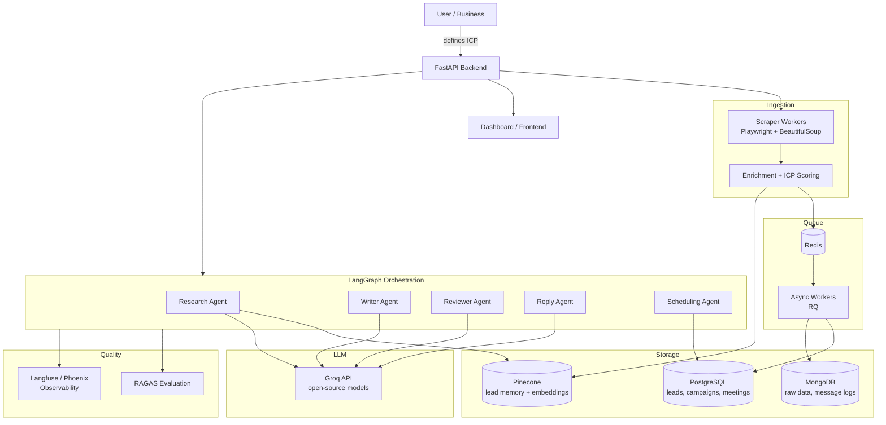
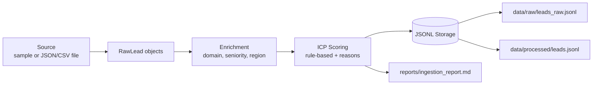
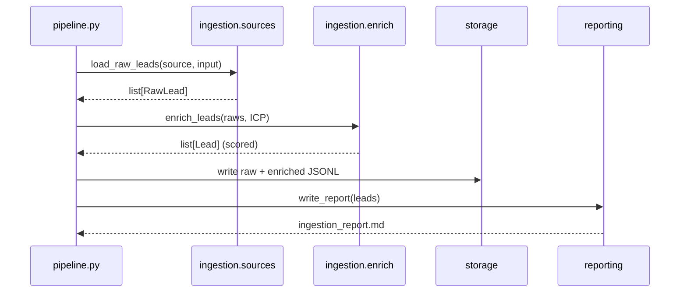

# Architecture

This document shows both the **target system** and the **current Day 1 build**. The diagrams use Mermaid, which renders automatically on GitHub and in most editors.

## Target System (Full Build)

## Day 1 Build (Implemented)

## Data Flow (Day 1)

## How The Days Map To The Diagram

| Day | Component added |
| --- | --- |
| 1 | Ingestion + enrichment + ICP scoring |
| 2 | PostgreSQL + MongoDB storage |
| 3 | Pinecone vector memory + research agent (RAG) |
| 4 | LangGraph outreach workflow |
| 5 | Reply + scheduling agents + Redis async workers |
| 6 | RAGAS evaluation + Langfuse/Phoenix observability |
| 7 | Docker + cloud deployment + dashboard |
