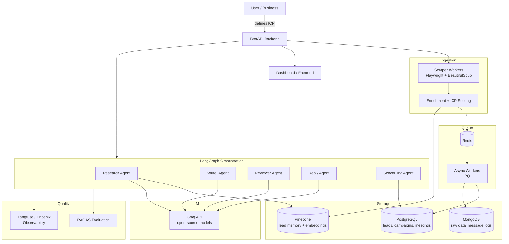
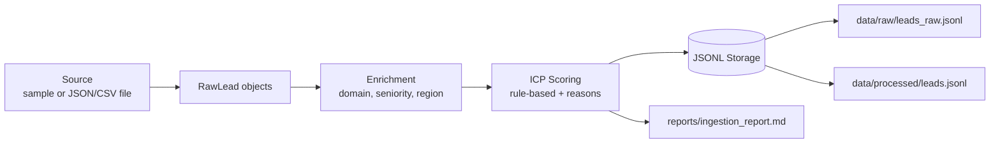
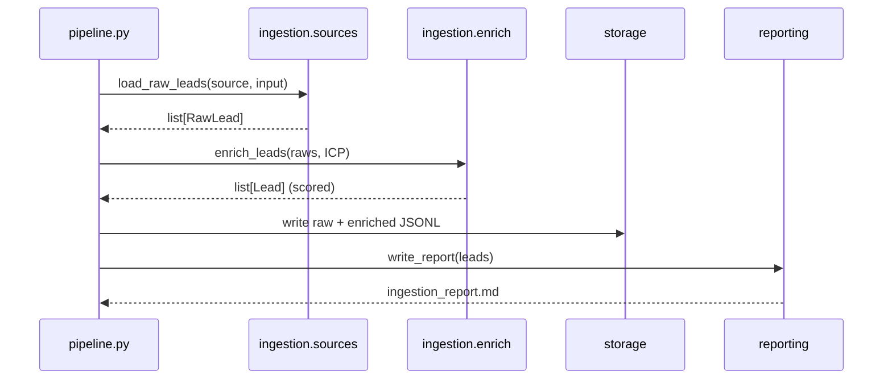

# Architecture

This document shows both the **target system** and the **current build**. The diagrams use Mermaid, which renders automatically on GitHub and in most editors.

## Target System (Full Build)

## Ingestion Build (Implemented)

## Data Flow (Ingestion)

## How Milestones Map To The Diagram

| Status | Component |
| --- | --- |
| Built | Ingestion + enrichment + ICP scoring |
| Built | PostgreSQL + MongoDB storage |
| Planned | Pinecone vector memory + research agent (RAG) |
| Planned | LangGraph outreach workflow |
| Planned | Reply + scheduling agents + Redis async workers |
| Planned | RAGAS evaluation + Langfuse/Phoenix observability |
| Planned | Docker + cloud deployment + dashboard |
